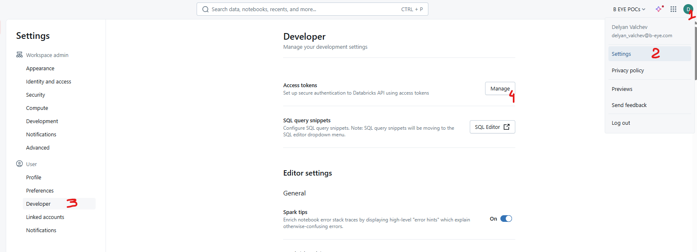
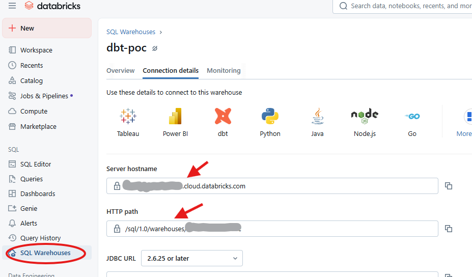

# POC Databricks dbt project
A simple dbt project to test the integration with Databricks.

## Initial setup

### 1. Install prerequisites (Git, Uv)
`winget install Git.Git astral-sh.uv`
### 2. Create virtual environment and install required packages
`uv sync`
### 3. Set in VS Code default python environment to be the venv:
Press Ctrl-Shift-P, search for "Python: Select Interpreter"
Select the `.\.venv\Scripts\python.exe` Recommended environemnt
### 4. Create a Databricks personal access token
In Databricks workspace, go to your profile->Settings->Developer->Access Tokens Manage:

Generate a new access token and make sure to copy it to a safe place. You will not be able to see it again once you click "Done"!
### 5. Check warehouse connectivity details
Take a note on the SQL warehouse configuration's connection information:

### 6. Create local profiles.yml file
Run the following commands in a terminal window:
```cmd
mkdir %userprofile%\.dbt
notepad %userprofile%\.dbt\profiles.yml
```
Paste the following contents in the profiles.yml:
```yaml
<profile_name>:
  outputs:
    dev:
      catalog: <catalog_name>
      host: <host>
      http_path: <http_path>
      schema: <schema>
      threads: 3
      token: <token>
      type: databricks
  target: dev
```
Change the placeholders as follows:
- `<profile_name>` - The name of the connection profile. This should correspond to the `profile:` entry in your **dbt_project.yml**
- `<catalog_name>` - Name of the default Databricks catalog
- `<host>` - The hostname of the Databricks SQL warehouse (from #5)
- `<http_path>` - The HTTP Path of the Databricks SQL warehouse (from #5)
- `<schema>` - The default schema
- `<token>` - Your personal access token (from #4)